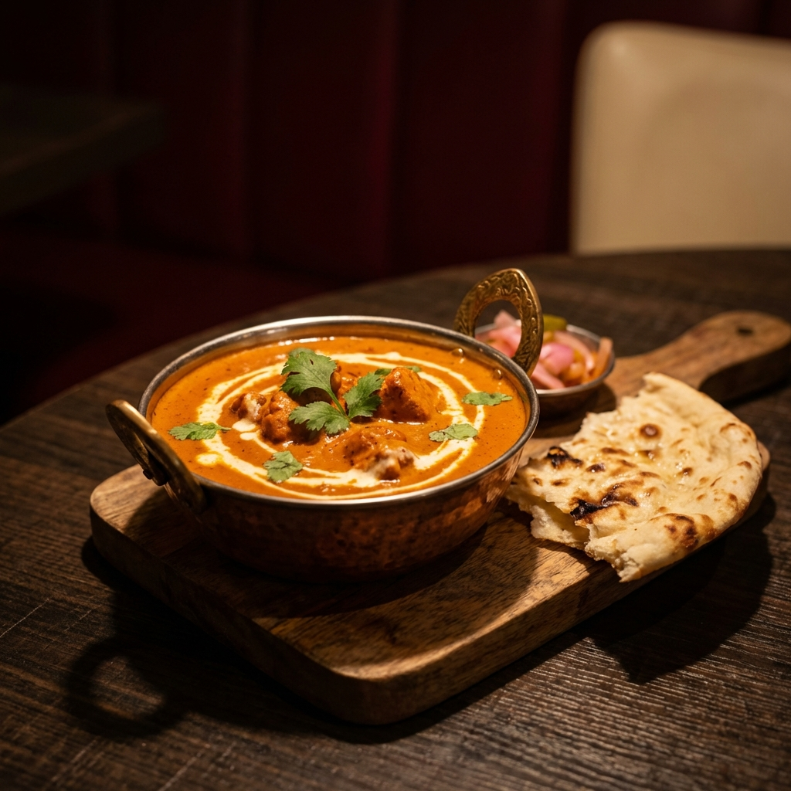

# Decyd - Food Decision Engine

> **Eliminate decision fatigue. Eat better, faster.**

A premium web application that provides instant, context-aware meal suggestions with immediate action paths for ordering or cooking.



## 🎯 Core Concept

Decyd aggressively reduces food decision fatigue by:
- Showing **ONE primary suggestion** (not a list)
- Providing **ONE backup option** (hidden by default)
- Offering **TWO clear actions** (Order or Make)
- **ZERO overwhelming choices**

## ✨ Features

### 🧠 Smart Recommendations
- **Context-aware**: Considers time of day, day of week, and weather
- **Learning algorithm**: Adapts to your preferences over time
- **Recency tracking**: Avoids showing the same food repeatedly

### 🍽️ Instant Action Paths

**Order Flow**
- One-click access to Swiggy and Zomato
- Pre-filled search with dish name

**Make Flow**
- Complete ingredient list
- Quick commerce integration (Blinkit, Instamart, Zepto)
- Embedded YouTube cooking video
- Concise step-by-step recipe (max 7 steps)

### 🎨 Premium Design
- Ultra high-quality food photography
- Warm, food-inspired color palette
- Modern typography (Outfit + Inter)
- Smooth, intentional animations
- Fully responsive (mobile-first)

## 🚀 Quick Start

### Run Locally

```bash
# Navigate to project directory
cd /home/omkarsingh/Desktop/Projects/Decyd

# Start local server
python3 -m http.server 8000

# Open in browser
# http://localhost:8000
```

### Requirements
- Modern web browser (Chrome, Firefox, Safari, Edge)
- No build step required
- No dependencies to install

## 📁 Project Structure

```
Decyd/
├── index.html              # Main HTML structure
├── styles.css              # Premium design system
├── app.js                  # Main application controller
├── data/
│   └── foods.json         # Curated food database
├── js/
│   ├── context-detector.js        # Context detection
│   ├── recommendation-engine.js   # Recommendation algorithm
│   ├── user-tracker.js            # User preferences
│   ├── components/                # UI components
│   └── utils/                     # Utilities
└── assets/
    └── images/                    # Food photography
```

## 🍽️ Food Database

Currently includes **8 popular Indian dishes**:
- Butter Chicken
- Masala Dosa
- Paneer Tikka
- Chole Bhature
- Vegetable Biryani
- Aloo Paratha
- Pav Bhaji
- Idli Sambar

Each dish includes:
- High-quality image
- Context-aware reasons
- Complete ingredients
- YouTube cooking video
- Step-by-step recipe

## 🎯 Design Philosophy

### Decision Fatigue Elimination
- **Fewer screens** - Direct paths to action
- **Fewer choices** - One primary, one backup
- **Faster decisions** - Instant recommendations
- **No scrolling** - Everything above the fold

### Premium Execution
- **Cinematic imagery** - Professional food photography
- **Modern aesthetics** - Warm colors, smooth gradients
- **Intentional animations** - 60fps transitions
- **Responsive design** - Works on all devices

## 🔧 Technology Stack

- **Pure Vanilla JavaScript** - No frameworks
- **HTML5** - Semantic markup
- **CSS3** - Modern design system
- **LocalStorage** - User preference tracking
- **YouTube Embed API** - Recipe videos

## 📱 Responsive Design

- **Mobile**: 320px - 767px
- **Tablet**: 768px - 1023px
- **Desktop**: 1024px+

## 🎨 Color Palette

- **Primary**: `#C73E1D` (Deep red-orange)
- **Accent**: `#E85D3C` (Bright coral)
- **Secondary**: `#F4A261` (Warm orange)
- **Cream**: `#FFF8F0` (Soft cream)
- **Text**: `#2D1B12` (Rich brown)

## 🚀 Future Enhancements

- [ ] Real weather API integration
- [ ] User accounts and cloud sync
- [ ] Dietary restrictions support
- [ ] Nutrition tracking
- [ ] Meal planning
- [ ] Restaurant partnerships

## 📄 License

This project is built as a demonstration of modern web development practices.

## 🙏 Acknowledgments

- Food images generated using AI
- Recipe videos from YouTube creators
- Typography: Google Fonts (Outfit, Inter)

---

**Built with ❤️ for people who hate deciding what to eat**
